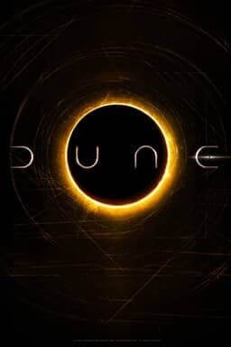

<p align="center">
  
</p>

<h1 align="center">Duna Movie — Landing Page Imersiva</h1>

<p align="center">
  Uma landing page cinematográfica inspirada em Duna, com foco em experiência premium, animações fluidas e narrativa visual.
  <br />
  O projeto foi construído para portfólio e exploração avançada de UI/UX com scroll-driven motion.
</p>

<p align="center">
  <a href="#-sobre-o-projeto">Sobre</a> •
  <a href="#-tecnologias">Tecnologias</a> •
  <a href="#-funcionalidades">Funcionalidades</a> •
  <a href="#%EF%B8%8F-como-executar">Como Executar</a> •
  <a href="#-licen%C3%A7a">Licença</a>
</p>

<p align="center">
  
  
  
  
  
  
  
</p>

## 📖 Sobre o Projeto

Este projeto entrega uma landing page temática do universo de Duna com abordagem cinematográfica, priorizando atmosfera, ritmo e impacto visual.

A arquitetura foi pensada para componentização e escalabilidade com Next.js App Router, enquanto a experiência de navegação combina scroll suave (Lenis), animações declarativas (Framer Motion) e interações avançadas com timeline e scroll trigger (GSAP).

## 🚀 Tecnologias

- [Next.js](https://nextjs.org/)
- [React](https://react.dev/)
- [TypeScript](https://www.typescriptlang.org/)
- [Tailwind CSS](https://tailwindcss.com/)
- [GSAP](https://gsap.com/)
- [Framer Motion](https://www.framer.com/motion/)
- [Lenis](https://lenis.darkroom.engineering/)
- [shadcn/ui](https://ui.shadcn.com/)
- [React Hook Form](https://react-hook-form.com/)
- [Zod](https://zod.dev/)
- [ESLint](https://eslint.org/)

## ✨ Funcionalidades

- 🎬 Hero com vídeo e animação scroll-driven.
- 🧭 Navegação com scroll suave entre seções.
- 🎞️ Galeria horizontal controlada pelo scroll vertical da página.
- 🌌 Seção parallax temática com composição cinematográfica.
- 🧩 Componentes reutilizáveis com base em shadcn/ui.
- ✅ Formulário com validação usando React Hook Form + Zod.
- 📱 Layout responsivo para desktop e mobile.

## 🛠️ Como Executar

### Pré-requisitos

- Node.js 20+ (recomendado)
- npm 10+ (ou versão compatível)

### Passo a passo

```bash
# 1) Clone o repositório
git clone <url-do-repositorio>

# 2) Entre na pasta do projeto
cd duna-movie

# 3) Instale as dependências
npm install

# 4) Rode em modo desenvolvimento
npm run dev
```

A aplicação ficará disponível em:

```bash
http://localhost:3000
```

Comandos úteis:

```bash
# Build de produção
npm run build

# Executar build
npm run start

# Lint
npm run lint

# Verificação de tipos
npm run typecheck
```

## 🤝 Contribuição

1. Faça um **Fork** do projeto.
2. Crie uma branch para sua feature:
   ```bash
   git checkout -b feat/minha-feature
   ```
3. Faça seus commits:
   ```bash
   git commit -m "feat: minha nova feature"
   ```
4. Envie para o seu repositório remoto:
   ```bash
   git push origin feat/minha-feature
   ```
5. Abra um **Pull Request** descrevendo claramente suas alterações.

## 📝 Licença

Este projeto está sob a licença **MIT**.

<p align="center">
  Feito por DasTechnologies
</p>
